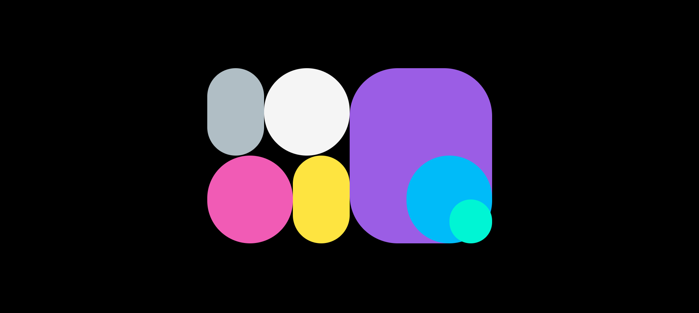

<div align="center">

</div>

# Dynamic CSS Shape Morphing Grid

A lightweight frontend experiment that explores **dynamic shape morphing, grid layouts, and CSS-based animation** using plain HTML, CSS, and JavaScript.

The project transforms a traditional grid into an interactive visual experience where shapes smoothly change their geometry and appearance through animation.

## ✨ Features

- 🎨 Dynamic CSS shape morphing
- 🔲 Grid-based visual layout
- ✨ Smooth transitions and animations
- ⚡ Built with vanilla HTML, CSS, and JavaScript
- 📱 Responsive layout
- 🧩 No frameworks or external dependencies required
- 🚀 Easy to run and customize

## 🛠️ Technologies

- **HTML5** — Structure and markup
- **CSS3** — Layout, styling, transitions, and shape animations
- **JavaScript** — Dynamic behavior and animation logic

## 📂 Project Structure

```text
Dynamic-CSS-Shape-Morphing-Grid/
├── index.html
├── style.css
├── script.js
└── README.md
```

## 🚀 Getting Started

### 1. Clone the repository

```bash
git clone https://github.com/BinaryVortex/Dynamic-CSS-Shape-Morphing-Grid.git
```

### 2. Open the project

Navigate into the project directory:

```bash
cd Dynamic-CSS-Shape-Morphing-Grid
```

### 3. Run it

Since this is a static frontend project, no build process or package installation is required.

Simply open `index.html` in your browser.

For the best development experience, you can also open the project in **Visual Studio Code** and use a local development server such as Live Server.

## 🌐 Live Demo

Try the project online:

**https://binaryvortex.github.io/Dynamic-CSS-Shape-Morphing-Grid/**

## 🎯 Purpose

This project was created as a creative frontend experiment to explore how **CSS shapes, grids, transitions, and JavaScript-driven interactions** can be combined to create visually engaging interfaces without relying on a large framework or animation library.

It is a small example of how simple web technologies can be pushed beyond traditional layouts to create more expressive UI experiences.

## 🧠 What I Explored

Through this project, I experimented with:

- CSS shape manipulation
- Grid-based compositions
- Morphing visual elements
- Animation timing and transitions
- DOM manipulation with JavaScript
- Responsive frontend design
- Creating interactive visual effects with minimal dependencies

## 🔧 Customization

You can easily experiment with the project by modifying:

- Shape dimensions
- Grid size
- Animation timing
- Transition effects
- Border radius and geometry
- Colors and visual styling
- JavaScript interaction logic

This makes the project a useful starting point for experimenting with animated backgrounds, interactive landing pages, creative portfolios, and other visual web experiences.


## 📄 License

This project is open source. Feel free to explore, modify, and build upon it.

---

Made with HTML, CSS, JavaScript, and a little bit of creative experimentation. ✨
